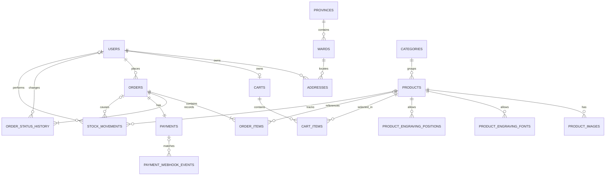

# Phase 1 — E-commerce Core

> Kiểm thử 2026-10-08: 29 unit + 32 PostgreSQL IT đạt; storefront/admin build và lint đạt; 15 nhóm kịch bản Chrome E2E local qua HTTP/backend/database riêng đạt. Customer session dùng fixture test (không Google callback), SePay dùng webhook ký HMAC test (không tiền live); chưa nghiệm thu mọi boundary/network/deployment. Chi tiết và phần chưa kiểm chứng: [e2e-validation.md](e2e-validation.md). Không đánh dấu toàn bộ Phase 1 hoàn thành.

> Timeline UI: admin actor CUSTOMER/SYSTEM/ADMIN hiển thị Khách hàng/Hệ thống/Quản trị viên; note SePay verified bank transfer hiển thị tiếng Việt ở cả storefront/admin. Giữ nguyên audit data, không xóa hai sự kiện tạo đơn và xác nhận tiền. Cả hai frontend build đạt.

> Order history UI: bỏ dòng order-card__delivery lặp ORDER_LABELS ngay cạnh status badge; chỉ giữ một nhãn trạng thái, không thay dữ liệu/API. Frontend build đạt sau sửa.

> Sửa layout customer order detail theo ảnh: thêm scope order-detail-page; orders-shell chuyển 1 cột thay grid sidebar 15.5rem, card body vertical flex thay grid summary 2 cột; totals giới hạn rộng và wrap text. Không đổi history list/API/order data. Frontend build/lint đạt; chưa browser regression detail với session khách thật. Ảnh người dùng hiển thị đơn chờ xác nhận/đã thanh toán là bằng chứng UI phía người dùng, chưa kiểm tra đối soát mọi giao dịch cũ.

> QR UI follow-up: tất cả 4 hàng bank/account/content/amount có copy button, dd flex + value span wrap + icon không shrink chống icon xuống hàng. Bỏ câu “Chỉ xác nhận thành công khi backend nhận giao dịch hợp lệ” khỏi notice theo yêu cầu; không đổi rule paid backend. Manual payment check có thông báo trạng thái pending/expired và timeout 15s (getPayment), không còn pending im lặng; frontend build/lint đạt, chưa browser kiểm tra modal/copy/timeout.

> Cập nhật SePay 2026-10-02: dashboard Send Test 200; giao dịch live tới backend nhưng code rỗng nên chưa paid. Theo yêu cầu đổi mã đơn mới sang VM+8 hex (10 ký tự tổng), không sửa đơn/giao dịch cũ; SePay cần mẫu VM, suffix 8, số và chữ. QR modal dùng minmax(0,1fr), min-width:0/overflow-wrap:anywhere chống tràn cả mã cũ. Frontend build và 29 unit + 27 PostgreSQL IT đạt (có assertion format mã); chưa browser modal regression, chưa live paid/đối soát giao dịch cũ.

> Tài liệu yêu cầu và kế hoạch triển khai của Vân Mộc.
> Trạng thái ban đầu dựa trên code và kết quả kiểm tra của session lập tài liệu; phải cập nhật khi nghiệm thu từng hạng mục.

## 1. Mục tiêu và phạm vi

Khách hàng mua sản phẩm thủ công từ sừng tự nhiên có sẵn, có thể yêu cầu khắc tên/nội dung.

Luồng chính:

```text
Đăng nhập Google → Xem sản phẩm → Chọn nội dung khắc (tùy chọn)
→ Giỏ hàng → Checkout → COD hoặc chuyển khoản SePay
→ Xem lịch sử, chi tiết và trạng thái đơn
```

### Trong phạm vi

- Đăng nhập Google, lưu tài khoản và xem hồ sơ cơ bản.
- Danh sách sản phẩm, lọc theo category, chi tiết sản phẩm.
- Chi tiết có tên, mô tả, giá, ảnh, chất liệu và tồn kho.
- Personalization trên sản phẩm có sẵn: nội dung khắc và các lựa chọn được hỗ trợ.
- Giỏ hàng: thêm, xóa, thay số lượng, lưu nội dung khắc, tính tiền.
- Checkout: người nhận, địa chỉ giao hàng, phương thức thanh toán.
- Thanh toán `COD`, `BANK_TRANSFER`; SePay là provider của chuyển khoản, không phải phương thức thứ ba.
- Tạo đơn, lịch sử đơn, chi tiết đơn và theo dõi trạng thái.
- Cơ chế tối thiểu để nhân viên có quyền cập nhật đơn và ghi nhận thu COD.
- Kiểm soát tồn kho, chống đơn trùng, chống webhook xử lý lặp và quyền sở hữu dữ liệu.

### Ngoài phạm vi

- Đặt chế tác sản phẩm hoàn toàn mới (`custom-order`).
- Voucher, tích điểm, đánh giá sản phẩm, marketplace.
- Tích hợp hãng vận chuyển hoặc hệ thống quản trị đầy đủ.
- Hoàn tiền tự động; có enum `REFUNDED` không đồng nghĩa đã có chức năng hoàn tiền.
- Truy xuất nguồn gốc không phải tiêu chí nghiệm thu Phase 1 này.

## 2. Kiến trúc và quy ước đã chốt

Backend là modular monolith, **N-tier chia theo chức năng**, không dùng Clean Architecture.

```text
com.vanmoc/
├── product/
├── location/
├── user/
├── cart/
├── order/
├── payment/
├── inventory/
└── shared/
```

Mỗi module chỉ tạo các package có nhu cầu:

```text
controller/ → service/ → repository/
entity/     dto/request/     dto/response/     mapper/     enums/
client/     initializer/     # Khi có tích hợp bên ngoài/startup
```

- Dùng tên `product`, không dùng `catalog` trong package.
- Entity là model nội bộ; không trả trực tiếp qua API.
- Controller nhận/validate request, gọi service, trả DTO; không tính tiền, trừ kho hoặc xác nhận thanh toán.
- Business rules ở service; mapper chuyển entity ↔ DTO.
- Không tạo domain record trùng entity, port/adapter chuyển tiếp hoặc interface + Impl không cần thiết.
- Không khai báo `length`, `nullable`, `optional` hoặc Bean Validation trên JPA entity.
- Validation đầu vào dùng Jakarta Bean Validation và `@Valid`; service kiểm tra nghiệp vụ. Bỏ annotation JPA không tự tạo validation.
- Giữ PK, FK, unique, version chống xung đột và precision của tiền.
- Tên bảng số nhiều, `snake_case`; ID nghiệp vụ UUID. Province/Ward dùng mã Integer.
- Tiền dùng PostgreSQL `NUMERIC(15,2)` và Java `BigDecimal`; Phase 1 dùng VND.
- Thời gian lưu UTC bằng `TIMESTAMPTZ`/`Instant`.
- Flyway quản lý schema, Hibernate `ddl-auto=validate`; không sửa migration đã áp dụng tùy tiện.
- Spring bắt buộc đọc `.env` trong working directory backend. YAML dùng `${VAR}`, không fallback `${VAR:default}`.
- `.env` không commit; `.env.example` là mẫu. Không đưa secret vào log/tài liệu.
- Quy định cho coding agent: [backend AGENTS.md](../van-moc-backend/AGENTS.md).

## 3. Database

Schema thực tế xem [migration V1](../van-moc-backend/src/main/resources/db/migration/V1__create_phase_one_tables.sql). Bảng dưới mô tả mục đích, không khẳng định mọi rule nghiệp vụ đã được triển khai.

| Bảng | Mục đích / dữ liệu chính |
|---|---|
| `users` | Google subject, email, tên, avatar, role, active |
| `provinces` | Mã, tên tỉnh/thành phố, division type, codename |
| `wards` | Mã, tên phường/xã và province code |
| `addresses` | Địa chỉ đã lưu của user, người nhận, phone, ward code, address line, default |
| `categories` | Tên, slug, thứ tự hiển thị, active |
| `products` | Category, SKU/code, slug, nội dung, chất liệu, giá, stock, cấu hình khắc, version |
| `product_images` | URL ảnh, storage key, alt text, thứ tự, primary |
| `product_engraving_fonts` | Font được phép của từng sản phẩm |
| `product_engraving_positions` | Vị trí được phép, giới hạn ký tự, thứ tự |
| `carts` | Một giỏ cho mỗi user |
| `cart_items` | Sản phẩm, số lượng, text/font/position khắc |
| `orders` | Mã đơn, user, trạng thái, tổng tiền, snapshot địa chỉ, idempotency key/request hash, timestamps/version |
| `order_items` | Snapshot SKU, tên, ảnh, giá, số lượng, nội dung khắc, phí khắc, line total |
| `order_status_history` | Trạng thái trước/sau, actor, người thay đổi, ghi chú |
| `payments` | Method/provider/status, expected/paid amount, transfer code, transaction ID, hạn thanh toán/version |
| `payment_webhook_events` | Payload JSONB, định danh provider, payment khớp, trạng thái xử lý và lỗi |
| `stock_movements` | Biến động tồn theo sản phẩm/đơn, reason, người thay đổi |

### 3.1. Quan hệ giữa các bảng



Các cardinality bắt buộc trên sơ đồ là **mục tiêu nghiệp vụ**. Schema hiện không khai báo NOT NULL cho mọi quan hệ; service phải bảo đảm đơn có ít nhất một item/history và một payment trong transaction.

- Một category có nhiều sản phẩm; mỗi sản phẩm thuộc một category.
- Một user có nhiều địa chỉ/đơn và tối đa một giỏ.
- Một đơn có nhiều items/history và một payment theo thiết kế Phase 1.
- Webhook chưa khớp có `payment_id = NULL`; actor hệ thống có thể không có user.
- `addresses` chỉ lưu ward code; province suy ra qua ward.
- `orders` lưu mã/tên tỉnh/phường và address line snapshot, không phụ thuộc địa chỉ đã lưu.

### 3.2. Bảo vệ dữ liệu

- Unique: Google subject/email, slug category, code/slug sản phẩm, user của giỏ, mã đơn, `(user_id, idempotency_key)`, mã chuyển khoản và định danh webhook.
- Partial unique index: một địa chỉ mặc định mỗi user; một ảnh primary mỗi sản phẩm.
- Giữ giá, tên, ảnh và nội dung khắc của đơn cũ bằng snapshot; sửa sản phẩm/địa chỉ không sửa đơn cũ.
- Không cascade xóa lịch sử đơn/thanh toán khi vô hiệu hóa user/product.
- Stock movement và status history là nhật ký append-only theo nghiệp vụ.
- Không coi unique hoặc `@Version` là thay thế cho transaction/kiểm soát đồng thời.

## 4. API

### 4.1. Đã có code

| Method | Endpoint | Mô tả |
|---|---|---|
| GET | `/api/provinces` | Danh sách tỉnh/thành phố |
| GET | `/api/provinces/{provinceCode}/wards` | Phường/xã theo tỉnh |
| GET | `/api/categories` | Category active |
| GET | `/api/products?categoryId=...&page=0&size=12` | Phân trang sản phẩm active thuộc category active |
| GET | `/api/products/{id}` | Chi tiết, ảnh và cấu hình khắc |

- Size 1–100, page >= 0; thứ tự hiện tại là createdAt giảm dần rồi ID tăng dần.
- Category không khớp trả trang rỗng; sản phẩm ẩn/không tồn tại trả 404.
- Sản phẩm hết hàng vẫn có thể được hiển thị.
- Danh sách có `imageUrl`: ưu tiên primary, fallback theo displayOrder/ID, không ảnh trả null; batch ảnh cho cả trang.
- Các API đọc trên public; route khác bị chặn cho đến khi có authentication.
- Các API đọc đã được kiểm chứng trên PostgreSQL 17.11 bằng Testcontainers ở mốc A; chưa kiểm tra database hiện có của người dùng hoặc nguồn địa giới live.

### 4.2. API dự kiến, chưa triển khai

| Nhóm | Method / endpoint | Quyền |
|---|---|---|
| Auth | `GET /oauth2/authorization/google` | Public |
| Auth | `GET /login/oauth2/code/google` | Callback do Spring Security xử lý |
| User | `GET /api/me`, `POST /api/auth/logout` | Đã đăng nhập |
| Address | `GET/POST /api/addresses`, `PATCH/DELETE /api/addresses/{id}` | Chủ sở hữu |
| Cart | `GET /api/cart`, `POST /api/cart/items` | Chủ sở hữu |
| Cart | `PATCH/DELETE /api/cart/items/{id}`, `DELETE /api/cart/items` | Chủ sở hữu |
| Checkout | `POST /api/checkout/preview` | Đã đăng nhập |
| Order | `POST /api/orders`, `GET /api/orders` | Đã đăng nhập |
| Order | `GET /api/orders/{id}`, `POST /api/orders/{id}/cancel` | Chủ sở hữu |
| Payment | `GET /api/orders/{id}/payment` | Chủ sở hữu |
| SePay | `POST /api/webhooks/sepay` | Xác thực provider, không dùng session khách |
| Admin | `GET /api/admin/orders`, `GET /api/admin/orders/{id}` | ADMIN |
| Admin | `POST /api/admin/orders/{id}/status` | ADMIN |
| Admin | `POST /api/admin/orders/{id}/payment/confirm-cod` | ADMIN |

Hợp đồng request/response cuối cùng cần chốt khi triển khai. Client không gửi giá/phí như nguồn tính tiền tin cậy.

Ví dụ dữ liệu personalization:

```json
{
  "productId": "<uuid>",
  "quantity": 2,
  "engraving": {
    "text": "An Nhiên",
    "font": "SCRIPT",
    "position": "FRONT"
  }
}
```

Ví dụ địa chỉ đầu vào:

```json
{
  "recipientName": "Nguyễn Thị An",
  "phone": "0901234567",
  "wardCode": 4,
  "addressLine": "Số nhà, tên đường"
}
```

Backend xác minh ward và suy ra province, không tin tên địa giới client gửi.

### 4.3. Lỗi

Dùng `ProblemDetail`; mã lỗi ổn định cho frontend. Các mã dự kiến:

| HTTP | Mã |
|---|---|
| 400 | `VALIDATION_ERROR`, `INVALID_PARAMETER`, `INVALID_ENGRAVING` |
| 401 | `AUTHENTICATION_REQUIRED` |
| 403 | `ACCESS_DENIED` |
| 404 | `PRODUCT_NOT_FOUND`, `PROVINCE_NOT_FOUND`, `ORDER_NOT_FOUND` |
| 409 | `INSUFFICIENT_STOCK`, `CHECKOUT_CHANGED`, `IDEMPOTENCY_CONFLICT`, `INVALID_ORDER_TRANSITION` |

Không tiết lộ thông tin nhạy cảm hoặc stack trace. Cần hoàn thiện nhất quán mã lỗi/thông báo Việt–Anh; chưa coi toàn bộ bảng này là đã triển khai.

## 5. Business rules mục tiêu

Những chính sách cần phê duyệt riêng xem mục 6. Không tự đưa chính sách còn mở thành hành vi production.

### 5.1. Authentication và quyền sở hữu

- Xác minh Google OIDC; lưu/tìm user theo `googleSubject`, không tự gộp tài khoản chỉ vì trùng email.
- Không cho user đọc/sửa địa chỉ, giỏ và đơn của người khác.
- Đề xuất web dùng session cookie HttpOnly/Secure, CSRF và CORS theo origin cấu hình.
- User bị vô hiệu hóa không được thực hiện thao tác mua hàng cần xác thực.

### 5.2. Khắc nội dung

- Chỉ nhận khắc nếu sản phẩm cho phép; font/vị trí thuộc cấu hình của sản phẩm.
- Chuẩn hóa Unicode, trim, kiểm tra ký tự/độ dài theo chính sách đã duyệt.
- Đề xuất không chấp nhận nội dung rỗng khi bật khắc; không tự thay bằng “Vân Mộc”.
- Một dòng quantity > 1 thể hiện nhiều chiếc có cùng nội dung khắc; nội dung khác là dòng khác.
- Dùng mã enum, không lưu nhãn giao diện như “Thư pháp” làm giá trị nghiệp vụ.
- Giới hạn vị trí không vượt giới hạn cấp sản phẩm.

### 5.3. Giỏ và tính tiền

- Thêm giỏ không giữ kho; giá giỏ là giá hiện tại từ backend.
- Tổng số lượng cùng sản phẩm phải xét qua mọi dòng personalization.
- Đề xuất gộp dòng cùng product/text/font/position.
- Preview kiểm tra giá/tồn/cấu hình, không giữ hàng hoặc bảo đảm giá đến lúc đặt.
- Đề xuất checkout theo `cartItemIds` được chọn, chỉ xóa dòng đã đặt thành công.
- Đề xuất phí khắc theo chiếc:

```text
productSubtotal = Σ(unitPrice × quantity)
engravingTotal = Σ(engravingUnitFee × quantity)
lineTotal = (unitPrice + engravingUnitFee) × quantity
grandTotal = productSubtotal + engravingTotal + shippingFee
```

- Backend tính tiền; nếu tổng thay đổi so với lần khách xác nhận thì yêu cầu xác nhận lại.

### 5.4. Tạo đơn và tồn kho

Đề xuất một transaction bao gồm:

1. Xác minh user, idempotency key và các dòng giỏ.
2. Khóa/kiểm tra sản phẩm theo thứ tự nhất quán; tổng hợp lượng mua theo product.
3. Kiểm tra active, stock, personalization và tính tiền.
4. Lưu order/items snapshot, payment và status history.
5. Trừ tồn, ghi stock movements và xóa dòng giỏ đã đặt.
6. Commit; lỗi thì rollback toàn bộ.

- Đề xuất stock là lượng còn có thể bán; trừ/giữ khi tạo đơn và hoàn khi hủy/hết hạn hợp lệ.
- Cùng idempotency key và cùng request trả đơn đã tạo; khác request trả conflict.
- Unique key, request hash, khóa/conditional update phải xử lý cả request đồng thời.
- Hoàn tồn tối đa một lần; không trừ lần nữa khi xác nhận đơn hoặc webhook paid.

### 5.5. Order state machine

Enum hiện có hỗ trợ luồng chi tiết hơn ví dụ `PENDING` trong yêu cầu:

```text
COD: PENDING_CONFIRMATION → CONFIRMED → PROCESSING
     → READY_TO_SHIP → SHIPPING → COMPLETED

BANK_TRANSFER: PENDING_PAYMENT → PENDING_CONFIRMATION
     → CONFIRMED → PROCESSING → READY_TO_SHIP → SHIPPING → COMPLETED

Nhánh hủy hợp lệ → CANCELLED
```

- Việc giữ các trạng thái chi tiết và quyền chuyển phải được duyệt ở mục 6.
- Không nhảy/quay ngược trạng thái tùy ý; mỗi chuyển trạng thái ghi actor/history/timestamp.
- Order status độc lập payment status.
- Đề xuất không hoàn tất COD trước khi xác nhận thu tiền.
- Chính sách hủy/hoàn tiền phải rõ trước triển khai; không cho khách hủy tự do sau khi đã khắc.

### 5.6. SePay

- Tạo đơn trước khi hiển thị QR; mã chuyển khoản sinh ở backend và là duy nhất.
- Frontend không được tự xác nhận paid bằng nút “Tôi đã chuyển khoản”.
- Xác thực webhook theo hợp đồng SePay thực tế; kiểm tra giao dịch vào, tài khoản thụ hưởng, mã và số tiền.
- Lưu payload/ID và chống xử lý lặp. Event đã nhận nhưng lỗi tạm thời cần retry, không coi là thành công.
- Job hết hạn, webhook và hủy dùng kiểm soát đồng thời để tránh vừa paid vừa hoàn tồn.
- Thiếu/dư tiền, không khớp mã hoặc giao dịch đến sau hủy/hết hạn cần đối soát; không tự khôi phục đơn.
- QR/countdown dựa trên dữ liệu và thời hạn backend; đề xuất polling trạng thái.

### 5.7. Init địa giới đã có code

- `DISABLED`: không init.
- `IF_EMPTY`: init nếu một trong hai bảng chưa có dữ liệu; không phát hiện dữ liệu thiếu khi cả hai đã có dòng.
- `REFRESH`: tải và upsert mỗi startup cho tới khi đổi mode.
- Tải cả tỉnh/phường ngoài transaction; kiểm tra rỗng/trùng/trường bắt buộc và tham chiếu tỉnh.
- Batch upsert trong một transaction; không xóa bản ghi cũ. Lỗi init làm startup thất bại.
- Có timeout cấu hình trong `.env`; không cần `phone_code` cho schema hiện tại.
- Database chứa seed Hà Nội cũ cần REFRESH một lần. Cập nhật seed không tự xóa dữ liệu đã tồn tại.

## 6. Quyết định nghiệp vụ còn cần chốt

### Điều chỉnh theo yêu cầu hoàn tác thiết kế/UI

Người dùng yêu cầu hoàn tác các thay đổi thiết kế/UI do assistant tạo. Đã khôi phục cấu trúc/class thiết kế cũ của catalog và chi tiết (filter drawer mobile, card/actions, gallery/lightbox, font cards/preview, breakdown, assurances, sticky CTA), giữ API/UUID và giỏ backend. Bỏ login card/CSS account mới và các khối sửa/bỏ khắc thêm vào trang giỏ; giữ chức năng Google login/account/address với style nền có sẵn. API sửa/bỏ khắc vẫn tồn tại, nhưng UI sửa trực tiếp trong giỏ đã gỡ theo yêu cầu này. Không bật lại checkout/lịch sử demo giả; nút checkout theo hình thức cũ nhưng disabled tới khi có checkout thật. Build/lint frontend đạt; chưa browser visual/E2E. Các bằng chứng UI mốc D trước đó cần đọc cùng điều chỉnh này. Backend, Google scope/configuration và `.env` không bị hoàn tác.

| Quyết định | Đề xuất hiện tại | Trạng thái |
|---|---|---|
| Bắt buộc đăng nhập khi thao tác giỏ/checkout | Có; catalog public | Chưa duyệt riêng |
| Giỏ khách và merge sau login | Chọn bỏ giỏ khách hoặc thiết kế merge có kiểm tra lại | Còn mở |
| Phí khắc | Theo từng chiếc | Chưa duyệt riêng |
| Nội dung khắc rỗng/ký tự được hỗ trợ | Chặn rỗng, không emoji mặc định; cho dấu câu thông dụng | Chưa duyệt riêng |
| Checkout theo lựa chọn | Dùng cartItemIds | Chưa duyệt riêng |
| Phí/phương thức giao hàng | Cấu hình backend; Phase 1 ưu tiên một phương thức | Còn mở |
| Thời điểm giữ tồn | Khi tạo đơn | Chưa duyệt riêng |
| Hạn chuyển khoản | Cấu hình backend, gợi ý 15 phút | Chưa duyệt riêng |
| Thanh toán xong | Chuyển sang chờ nhân viên xác nhận | Chưa duyệt riêng |
| Khách tự hủy | COD chờ xác nhận hoặc chuyển khoản chưa paid/chờ trả tiền | Chưa duyệt riêng |
| Trạng thái chi tiết | Giữ enum hiện có, ánh xạ nhãn trên UI | Chưa duyệt riêng |
| Chuyển khoản nhiều lần/thiếu/dư | Một giao dịch đúng tiền; tình huống khác xử lý thủ công | Chưa duyệt riêng |
| Hủy đơn đã trả tiền | Quy trình thủ công có quyền hạn và ghi nhận hoàn tiền | Còn mở |

### Phê duyệt trực tiếp của người dùng — session triển khai tiếp theo

Người dùng đã duyệt: giỏ/checkout bắt buộc đăng nhập; không tự merge giỏ demo/giỏ khách; gộp dòng cùng product/text/font/position; phí khắc theo từng chiếc; NFC + trim, chặn rỗng/control/emoji, cho chữ/số/dấu câu thông dụng; checkout theo cartItemIds. Shipping một phương thức phí cố định **30.000 VND/đơn**, cấu hình backend bắt buộc. Giữ/trừ tồn khi tạo đơn; hoàn một lần khi hủy/hết hạn; hạn chuyển khoản **15 phút**. Giữ state machine chi tiết ở mục 5.5, admin chỉ chuyển tiến từng bước, COD chỉ hoàn tất sau thu tiền. Khách chỉ hủy COD chờ xác nhận hoặc chuyển khoản chờ thanh toán/chưa paid; không có API tự hủy/hoàn tiền đơn paid trong Phase 1. SePay tự paid chỉ khi một giao dịch vào khớp mã/tài khoản/đúng tiền; thiếu/dư/nhiều lần/đến muộn đối soát thủ công, không khôi phục đơn. Người dùng chọn **làm stub trước**; Google/SePay live chưa được nghiệm thu. Đây là phê duyệt mới thay cho trạng thái chưa duyệt trong bảng ban đầu, không phải phê duyệt luồng hoàn tiền tự động.

Kiến trúc N-tier, tên product, mô hình địa chỉ, cấu hình .env và cách init địa giới đã được chốt; không suy ra các chính sách trên cũng đã được duyệt.

## 7. Trạng thái triển khai ban đầu

| Hạng mục | Đã có | Còn thiếu |
|---|---|---|
| Nền tảng | N-tier, entity, migration, .env, compose, lỗi, architecture test; Flyway/Hibernate validate và security/CORS test trên PostgreSQL 17.11 | Kiểm tra deployment/database hiện có |
| Location | API đọc, client/init/batch upsert, unit và PostgreSQL upsert/rollback tests | Xác minh nguồn địa giới live và tính đầy đủ dữ liệu |
| Product | API danh sách/category/chi tiết, ảnh đại diện batch, DTO, mapper, service, PostgreSQL persistence tests | Nối frontend |
| Auth/user | OIDC wiring, me/logout/CSRF, địa chỉ API/trang thật, ownership và auditing tests PostgreSQL | Google callback/session browser live và deployment verification |
| Khắc/cart | Cart API theo user, validate, tiền/phí backend, frontend dùng API; ownership/concurrent merge tests PostgreSQL | Browser E2E sau cấu hình Google thật, checkout revalidation ở mốc E |
| Checkout/COD | Entity, UI mô phỏng | Tạo đơn transaction, giữ tồn, COD và idempotency |
| SePay | Entity/payment/webhook, QR demo | Xác thực webhook, đối soát, expiry/retry và UI trạng thái thật |
| Order | Entity/history, UI lịch sử demo | Lịch sử/chi tiết API thật, timeline và quản lý trạng thái |

Xác minh mốc A: 25 test không cần database và 8 PostgreSQL integration tests đạt. Lần cập nhật B/C/D: catalog và cart đã dùng API thật, hồ sơ/địa chỉ có API/trang thật; Google wiring chưa nghiệm thu live. Checkout/đơn/SePay thật chưa triển khai. Không phải luồng e-commerce hoàn chỉnh.

## 8. Kế hoạch thực hiện và checklist

### Mốc A — Nền tảng và catalog backend

- [x] PostgreSQL từ database rỗng: Flyway và Hibernate validate chạy thành công.
- [x] Init địa giới thành công; kiểm tra repeat import và rollback bằng integration test (client stub, database thật).
- [x] Repository query phân trang/active/category đã kiểm chứng.
- [x] Danh sách có ảnh đại diện: primary, fallback thứ tự displayOrder/ID, không ảnh trả null.
- [x] Không N+1 khi lấy ảnh/danh mục danh sách.
- [x] API public/CORS qua security filter được test.
- [x] Error contract và thông báo validation của API đọc được kiểm chứng; mã lỗi cho các module chưa triển khai vẫn chưa nghiệm thu.

#### Bằng chứng và điểm dừng mốc A — 2026-10-02

- Đã đọc toàn bộ tài liệu, backend AGENTS/README và code backend hiện tại trước khi sửa. Repository có thay đổi staged/unstaged/untracked sẵn; không reset/revert hoặc thay migration.
- Code hiện tại đã có imageUrl và Testcontainers trước session này; giữ nguyên triển khai, bổ sung `fullPageCountsAndEmptyPagesKeepQueryBudget` trong `src/test/java/com/vanmoc/integration/PostgresReadApiIT.java`.
- Chạy từ `van-moc-backend`: đặt `JAVA_HOME` tới JDK 21 trên máy, thêm `JAVA_HOME/bin` vào PATH của tiến trình rồi chạy `.\mvnw.cmd -Pintegration verify`.
- Kết quả cuối: BUILD SUCCESS; Surefire 25/25, Failsafe 8/8; PostgreSQL 17.11 (`postgres:17-alpine`), Java 21.0.12. Flyway áp dụng V1 và local seed trên schema rỗng; Hibernate validate toàn bộ 17 entity.
- Test xác minh ảnh primary/fallback/tie/null, active/category, pagination, engraving limits, public reads, CORS allow/deny, ProblemDetail Việt–Anh, import lặp và rollback xuyên batch. Trang đầy dùng đúng 3 query (page/count/images); trang rỗng dùng 2 query và không tải ảnh.
- Không test nào bị chặn ở mốc A. Không truy cập/sửa database hoặc volume hiện có; không gọi nguồn địa giới live. Init đã test với client stub và transaction PostgreSQL thật, không phải xác minh tính đầy đủ dữ liệu hành chính production.
- Không đổi API/schema/migration trong session này. README backend đã mô tả đúng API và cách chạy integration tests.
- Dừng tại ranh giới mốc A ổn định. Mốc tiếp theo: B — đọc frontend hiện tại, nối catalog API/UUID, trạng thái tải/lỗi/hết hàng và xử lý local cart cũ an toàn; chạy build/lint.
- Các chính sách mục 6 vẫn chưa được duyệt; phải hỏi trước khi triển khai hành vi giỏ/khắc hoặc checkout liên quan. Google credentials/deployment cookie và cấu hình SePay thật vẫn cần cung cấp ở các mốc sau; không đưa secret vào báo cáo.

### Mốc B — Frontend catalog

- [x] Thay hardcoded product ở danh sách/chi tiết bằng API, dùng UUID.
- [x] Giá/tồn/font/vị trí/phí khắc lấy từ backend.
- [x] Loading, lỗi, không tìm thấy và hết hàng rõ ràng.
- [x] Kiểu dữ liệu giỏ tương thích dữ liệu mới; xử lý dữ liệu local cũ an toàn.

#### Bằng chứng mốc B

- Frontend hiện ở `van-moc-frontend/`, không còn ở root; đối chiếu layout thực tế trước sửa.
- API client `src/api/catalog.ts`, `.env.example` bắt buộc `VITE_API_BASE_URL`; danh sách/chi tiết dùng API thật, UUID, server pagination và không fallback sang sản phẩm mẫu khi ID sai.
- Giỏ UUID tạm dùng namespace riêng, kiểm tra dữ liệu tải; không đọc/chuyển/ghi đè key `van-moc-cart` cũ. Chưa phải giỏ backend theo user; phải thay ở mốc D.
- `npm run build` và `npm run lint`: đạt. Chưa chạy browser E2E/API live của frontend, không coi build/lint là nghiệm thu toàn bộ luồng mua hàng.

### Mốc C — Authentication và user

- [x] Google OIDC đã nối backend, upsert theo subject, role/active từ database (chưa xác minh Google live).
- [x] Me/logout, session-bound CSRF, credentialed CORS và cookie cấu hình theo deployment (chưa browser/deployment E2E).
- [x] API/trang hồ sơ và địa chỉ dùng backend, ownership kiểm chứng trên PostgreSQL.
- [x] AuditorAware lấy local UUID từ principal đã xác thực; kiểm chứng created_by qua API/PostgreSQL.

#### Bằng chứng mốc C và giới hạn nghiệm thu

- Sửa lỗi PostgreSQL UTF8 0x00 ở tham số SESSION_ID: HttpSessionIdResolver chỉ nhận UUID hợp lệ sau giải mã cookie, bỏ cookie Tomcat cũ/malformed trước JDBC. Không sửa bảng/migration hoặc xóa dữ liệu. Regression test gồm Tomcat-shaped ID, Base64 chứa NUL, non-UUID và invalid Base64; `/api/me` trả 401, CSRF tạo cookie mới, phiên hợp lệ/logout/expiry vẫn đạt. Verification mục tiêu: 29 unit + 3 session integration tests đạt. Full suite: 18/19 integration đạt, còn test subjectIdentityAddressOwnershipAndDefaultArePersisted mong tên "Updated A" trong khi UserService hiện giữ tên "User A" sau login; không sửa logic hồ sơ ngoài phạm vi lỗi cookie.

- Theo yêu cầu người dùng, session chuyển sang Spring Session JDBC/PostgreSQL. Migration mới V2 tạo bảng/index/FK cascade; Spring không tự tạo schema. Cookie serializer giữ JSESSIONID/HttpOnly/path `/` và Secure/SameSite theo cấu hình. `.env` được bổ sung riêng SESSION_TIMEOUT=30m, SESSION_CLEANUP_CRON (mỗi phút), không ghi đè khóa hiện có. Tests dùng PostgreSQL tạm kiểm chứng persistence/deserialization principal, cookie `/api/me`, CSRF logout xóa dữ liệu, expiry và cleanup. `mvnw.cmd -Pintegration -DskipITs=false -DskipTests=false verify`: 26 unit + 18 integration tests đạt. Chưa chạy migration trên database người dùng hoặc xác minh Google/browser/restart live; session RAM cũ cần login lại sau restart. Không thay UI hoặc chuyển sang JWT.

- Sửa lỗi Google `400 invalid_scope` khi YAML chứa một phần tử `openid,profile,email`: tách scope thành ba phần tử `openid`, `profile`, `email`. Regression test kiểm tra cả ClientRegistration lẫn scope trên authorization redirect. Chạy `mvnw.cmd -Pintegration -DskipITs=false -DskipTests=false -Dit.test=PostgresReadApiIT verify`: 26 unit + 16 PostgreSQL integration tests đạt. Người dùng cần restart backend và bắt đầu login mới; chưa xác nhận callback Google live thành công.

- Thêm OAuth2 client dependency, Google OIDC user service, user/address controller → service → repository, DTO/mapper, CSRF endpoint và AuditorAware. Không đổi entity hoặc migration.
- API: Google authorization/callback, `GET /api/me`, `GET /api/auth/csrf`, `POST /api/auth/logout`, `GET/POST /api/addresses`, `PATCH/DELETE /api/addresses/{id}`. PATCH nhận toàn bộ trường sửa được; ward suy ra province, mặc định được serialize theo user.
- Frontend `/login`, `/account`, `/account/addresses` gọi API thật với credentials/CSRF, không có fake-login route production.
- `.env.example` và README đã bổ sung Google/cookie/callback/deployment hướng dẫn. Không ghi đè backend `.env` hiện có; cần người dùng thêm các biến mới trước khi chạy ứng dụng bình thường. Integration test override bằng credentials test, không gọi Google.
- `./mvnw.cmd -Pintegration verify`: 26 unit/controller/architecture tests và 11 PostgreSQL integration tests đạt, không fail/error/skip. Tests gồm subject không merge email, inactive, ownership hai user, default address, API validation, CSRF/logout và auditing actor. Đã sửa lỗi missing primitive boolean bị deserialize trước validation bằng Boolean + @NotNull ở request.
- Frontend `npm run build`, `npm run lint`: đạt sau khi thêm account/address UI. Chưa chạy Google callback thật/session browser hoặc browser E2E; checklist đánh dấu triển khai/test nội bộ, **không phải nghiệm thu Google production**. Test principal chỉ tồn tại ở test source.

### Mốc D — Cart/personalization

- [x] Chốt các chính sách giỏ/khắc (phê duyệt ở mục 6).
- [x] Thêm/xóa/đổi số lượng và personalization qua API; frontend giỏ thật, sửa/bỏ nội dung khắc.
- [x] Giá/tổng do backend tính, tổng số lượng kiểm tra qua các dòng cùng product; checkout vẫn phải kiểm tra lại ở mốc E.
- [x] Giỏ lưu theo user; ownership và concurrency được test trên PostgreSQL.

#### Bằng chứng mốc D

- Cart controller → service → repository, request/response/mapper trong module; EngravingService dùng cấu hình sản phẩm. Không đổi entity/migration. Request không có trường giá/phí; API tính lại BigDecimal và phí theo quantity.
- API `GET /api/cart`, `POST /api/cart/items`, `PATCH/DELETE /api/cart/items/{id}`, `DELETE /api/cart/items`. PATCH null engraving bỏ khắc; cấu hình trùng được gộp, khác nội dung là dòng riêng. Owner lock serialize tạo giỏ/thao tác đồng thời; add cart không giữ/trừ tồn.
- CartContext frontend chỉ dùng API theo session, không đọc/ghi localStorage, không merge giỏ cũ; tải lại theo route, lỗi auth hiển thị link login. Trang giỏ sửa quantity/nội dung, bỏ khắc, xóa dòng/toàn bộ; tổng dòng từ backend.
- Route checkout và order-history demo đã ngắt để không đi từ giỏ thật sang luồng giả thanh toán/lịch sử mẫu. File demo giữ nguyên, không xóa thay đổi sẵn của người dùng; cần thay route bằng luồng thật ở mốc E.
- Tests PostgreSQL: hai user, quantity > 1/phí theo chiếc, normalized merge, khác nội dung, tổng lượng theo product, cấu hình rỗng/quá dài/emoji/control/font sai/disabled/inactive. Thêm tests concurrent merge và API price tampering/CSRF/quantity.
- Google live/browser E2E chưa chạy; không coi test principal/mock login là đã nghiệm thu Google thật. Mốc E/F/G còn thiếu.
- Kết quả mốc D: `.\mvnw.cmd -Pintegration verify` BUILD SUCCESS, **26 unit/controller/architecture + 15 PostgreSQL integration tests**, không fail/error/skip. `npm run build`, `npm run lint` đạt; chưa browser E2E. Database/volume hiện có không bị truy cập/sửa.
- Điểm dừng ổn định của session: hết lát cắt D. Không tạo class order/payment chưa sử dụng, không tuyên bố full Phase 1. Tiếp tục E → F → G; chính sách đã duyệt ở mục 6, không cần hỏi lại trừ khi có quy tắc mới ảnh hưởng tiền/trạng thái. Cần thêm biến shipping/payment timeout bắt buộc khi triển khai E, không YAML fallback.

### Mốc E — Checkout/COD/order

#### Backend đơn hàng đã triển khai

- POST `/api/checkout/preview` và `/api/checkout`: session active, địa chỉ/cart ownership, chọn `cartItemIds`, backend tính giá/khắc mỗi chiếc + ship 30.000đ. Snapshot địa chỉ/sản phẩm/khắc; transaction tạo order/payment/history/stock movement và chỉ xóa dòng giỏ đã đặt.
- Idempotency theo user/key + request hash; retry trả đơn cũ, payload đổi trả conflict. Khóa user và sản phẩm theo UUID để chống oversell; truy vấn checkout không eager-load sản phẩm trước khóa.
- COD pending-confirmation/payment pending; chuyển khoản pending-payment, deadline 15 phút, transfer code từ order backend. Cấu hình `.env`: SHIPPING_FEE=30000, PAYMENT_TIMEOUT_MINUTES=15, không ghi đè giá trị cũ.
- GET `/api/orders` và `/api/orders/{id}`: danh sách phân trang, snapshot/timeline và ownership. POST `/api/orders/{id}/cancel`: chỉ unconfirmed COD hoặc unpaid bank; đổi cancelled và hoàn tồn một lần. Scheduled expiry quét 100 đơn/lần mỗi 60s, mỗi đơn transaction riêng, EXPIRED/cancelled/hoàn tồn.
- PATCH `/api/admin/orders/{id}/status`: role ADMIN kiểm tra từ DB, đi tuần tự; COD completed phải collectCod=true. Paid bank không cho khách hủy; refund manual. Webhook/cancel/expiry cùng lock order→payment→product (khi cần).
- Verification hiện tại: **29 unit + toàn bộ 24 PostgreSQL integration tests đạt**. Test checkout snapshot/idempotency/cancel repeat, hai khách mua chiếc cuối, expiry repeat, ownership, admin transitions/COD collection, SePay regressions. Sửa assertion profile cũ để phản ánh behavior hiện có: Google login giữ tên đã lưu; không sửa profile logic.
- **Chưa nghiệm thu E:** checkout/history demo frontend vẫn ngắt kết nối, CTA cart chưa bật; chưa có browser E2E, admin UI, test race cancel/webhook/expiry, cùng-user concurrent retry hoặc injection rollback. SePay live tiếp tục hoãn. Không đổi thiết kế hoặc chạy migration trên DB đang dùng.

#### Frontend đã nối API thật

#### Chính sách phí ship theo tỉnh/thành (thay mức cố định)

#### Admin frontend riêng

#### Admin quản lý đơn hàng — đang triển khai

#### Admin sản phẩm/tồn kho — đang triển khai

#### UI lấy màn template làm nền — cập nhật

##### Browser smoke thực tế — 2026-10-02

- Chrome headless qua CDP, profile riêng trong Temp/opencode, truy cập frontend 5174/backend đang chạy; không mock API, không sửa dữ liệu nghiệp vụ DB đang chạy. Login admin/password thành công, session giữ qua navigation/reload, logout trở về login.
- Desktop 1440×1000: products input/2 selects/checkbox/button cùng centerY=333, input/select/button h=44; font computed Outfit; không overflow ngang. Sidebar expanded 290, collapsed 90, 4 icons cùng x=32.5/w=24. Chụp và xem ảnh desktop. Search chuỗi không tồn tại hiển thị empty, đổi active=false và reset empty value thành công.
- Mobile 390×844: không overflow ngang products; menu mở x=0/w=290, click Orders chuyển route và đóng offcanvas x=-90. Toggle dark bật class dark. Orders/shipping/products-new tải không alert; không có Runtime.exceptionThrown trong lượt browser smoke.
- Evidence: `C:/Users/Acer/AppData/Local/Temp/opencode/vanmoc-browser-test.mjs`, `vanmoc-browser-results.json`, ảnh `vanmoc-products-desktop.png`, `vanmoc-products-collapsed.png`, `vanmoc-products-mobile.png`, `vanmoc-mobile-menu.png`. Script dùng Node built-in WebSocket/CDP, không cài package; chứa credentials bootstrap local, không đưa vào repo.
- Chạy lại Maven integration: **29 unit + 27 PostgreSQL IT**, 0 failures/errors/skips, BUILD SUCCESS. Đây là backend regression, không thay thế browser checkout E2E.
- Chưa nghiệm thu toàn bộ: browser chưa submit create/edit/stock/ship hoặc advance order, chưa end-to-end customer Google/cart/checkout/COD, chưa SePay live, chưa so toàn bộ UI với demo. Header vẫn thích nghi. Không đánh dấu các acceptance đó đạt chỉ vì smoke thành công.

- Sửa theo ảnh màn products: gom search/status/category/stock checkbox/submit vào cùng ComponentCard, flex items-center; input/select và checkbox row cao h-11, nút size sm. Category không còn đứng riêng ngoài hàng. Select gốc được thêm controlled value/allowEmpty để reset filter. Sidebar lấy direct-link structure/classes từ AppSidebar gốc (gap-1, group/menu-item, icon-size/active/text, collapsed centering), thay ký tự icon bằng SVG gốc box/table/dollar-line/arrow-right dưới public/images/icons, dùng mask currentColor không cài package. Branding vẫn Vân Mộc, không thêm demo menu/widget. Build/lint đạt; chưa browser visual, header và các phần adapter còn lại chưa chuyển hết.

- Kiểm tra CSS: `src/main.tsx` import `src/index.css`; so với template stylesheet chỉ thêm `@source` và adapter block, theme/style gốc giữ nguyên. Dev server `5174/src/index.css` trả 200 và có utilities/theme biên dịch. Đã bỏ adapter broad selectors cho `.orders-content`/`.admin-login` h1/p/a/button để tránh ghi đè component; phí ship chuyển input/actions sang components gốc. Build đạt sau sửa. Chưa có browser visual/computed-style evidence, không kết luận màn người dùng đang xem đã giống template.

- [x] Orders/products table lấy structure/classes từ `components/tables/BasicTables/BasicTableOne.tsx` trong repo Free; chuyển data thành props ở `components/tables/BasicTable.tsx`, giữ wrapper/header/cell/dividers/dark style, thay nhãn/dữ liệu thật, Badge gốc. Không phải chỉ dùng table primitive.
- [x] Copy `ComponentCard`, `PageBreadCrumb`, `Badge`, `TextArea`, `Select` gốc vào admin. Orders/products list và editor thông tin sản phẩm/phí ship dùng ComponentCard header/body gốc; editor dùng TextArea gốc, form spacing/grid theo form examples. Select đã copy nhưng các select hiện tại chưa thay hết; stock/history còn có wrapper adapter cũ.
- [x] Chi tiết nhận hàng/payment dùng layout read-only từ `UserProfile/UserAddressCard.tsx`, nằm trong container từ `pages/UserProfiles.tsx` (InformationCard). Timeline/actions dùng ComponentCard. Repo Free không có order/product detail chuyên biệt; không tuyên bố lấy màn invoice/order Pro.
- [x] Admin build/lint đạt sau thay đổi. Backend/API/session/CSRF không đổi; không đổi storefront CSS.
- [ ] Visual/browser E2E, hoàn thiện chuyển các filter/stock/history wrappers còn lại và sidebar/header gốc (sidebar/header hiện vẫn bản thích nghi trước, không nguyên bản).

- Verification FE phiên bản cuối (sau category filter/error messages): `npm run build` và `npm run lint` đạt, không warnings.

- [x] Backend danh sách/tạo/sửa sản phẩm và cấu hình khắc, quyền ADMIN active.
- [x] Điều chỉnh tồn có delta/lý do, khóa sản phẩm, lịch sử phân trang.
- [x] FE TailAdmin danh sách/editor/tồn kho nối API thật.
- [x] PostgreSQL tests và FE build/lint.
- [ ] Upload/quản lý ảnh: chưa chốt nơi lưu, không tự thêm storage provider.
- [ ] Browser E2E/visual.
- API `/api/admin/products`: phân trang 20, tìm name/code, category/active/stock=0 filters; tạo/sửa thông tin và font/vị trí/limit/fee. Sản phẩm mới stock 0; không cho sửa stock qua product DTO. Mã/slug duplicate conflict, kiểm tra version chống stale product writes, transaction thay cấu hình khắc. Không xóa sản phẩm đã dùng, ngừng bán bằng active=false. Giá nguyên VND không âm. Chưa quản lý danh mục ngừng hoạt động trong FE (dropdown dùng public categories).
- `/api/admin/products/{id}/stock`: POST delta ±1.000.000 + note bắt buộc, lock product, chống âm/overflow, stock movement ADMIN_ADJUSTMENT có actor. GET lịch sử 20/trang cả admin adjustment và order movements, link đơn. Chưa có idempotency cho stock mutation: nếu timeout phải kiểm tra lịch sử trước retry.
- Admin UI `/products`, `/products/new`, `/products/:id` dùng TailAdmin table/input/label/button; price/material/content/active/engraving + stock delta/history. Không upload/sửa ảnh trong lượt này, giữ ảnh cũ. Không thêm migration, không đổi CSS storefront.
- Verification: **29 unit + 27 PostgreSQL integration tests đạt**; test create/filter/stock0, quyền customer denied, delta history/actor, âm stock rollback, stale version sau stock change, replace fonts, duplicate code/slug. Admin build/lint đạt trước bổ sung dropdown category/error messages; kiểm tra FE cuối bên dưới. Chưa browser E2E hoặc concurrency stock-adjust vs checkout (chỉ dùng cùng lock product), chưa nghiệm thu toàn bộ mốc.

- [x] API admin danh sách phân trang/tìm mã/lọc trạng thái/phương thức thanh toán, kiểm tra ADMIN active từ DB.
- [x] API admin chi tiết snapshot/timeline/payment.
- [x] UI TailAdmin danh sách và chi tiết, chuyển trạng thái tuần tự và xác nhận thu COD.
- [x] Test PostgreSQL quyền đọc và filters; regression transitions/COD; FE build/lint.
- [ ] Browser E2E admin orders (không thay thế bằng build/mock).
- SePay live vẫn hoãn; không thêm thao tác khách/admin tự paid bank trong lượt này.
- API mới: GET `/api/admin/orders?search=&status=&method=&page=0` (20 đơn/trang, createdAt/id giảm dần), GET `/api/admin/orders/{id}` (snapshot + timeline + trạng thái/expected/paid amount/code/deadline). PATCH status tái sử dụng lifecycle backend, giữ CSRF và quyền ADMIN active. Search theo chuỗi trong mã đơn; filter từ backend áp dụng toàn danh sách, không chỉ trang hiện tại.
- UI `/orders`, `/orders/:id` trong admin port 5174; thêm menu và redirect mặc định vào đơn hàng. Table primitive lấy từ TailAdmin, theme/badge/form/buttons theo CSS gốc. Hiển thị chi tiết địa chỉ/khắc/tiền/timeline, xác nhận trước mutation; chỉ bước kế tiếp và checkbox collect COD khi completed. Không thao tác refund/hủy paid/đánh dấu paid bank. Không đổi storefront.
- Verification sau thay đổi: **29 unit + toàn bộ 26 PostgreSQL integration tests đạt**, bổ sung assertions vào tests hiện có cho filter/search/admin detail/customer denied/local session admin orders; regressions COD/stock/expiry/SePay vẫn đạt. Admin `npm run build` + `npm run lint` đạt. Không có migration mới ở lượt quản lý đơn. Browser E2E/visual chưa chạy, không đánh dấu toàn mốc E hoặc Phase 1 hoàn thành.

- Verification phiên bản cuối của thay đổi admin login/template: **29 unit + toàn bộ 26 PostgreSQL integration tests đạt**, bao gồm mật khẩu đã đổi không bị initializer reset; admin build/lint đạt. Chưa browser E2E.

- Cập nhật theo yêu cầu: admin đăng nhập username/password trực tiếp, không cần Google storefront. V4 thêm username unique/password_hash; initializer tạo admin/vanmoc@2026 chỉ khi chưa tồn tại, BCrypt, ON CONFLICT chống seed trùng, không reset password/role/active. ADMIN_INITIAL_PASSWORD có thể override trước lần tạo đầu; default public cần thay trước deployment. Form login Spring Security + session fixation protection/JDBC session + CSRF; admin me/shipping/order-status hỗ trợ identity local và kiểm tra quyền DB. Chưa có password change UI/rate-limit, chưa nghiệm thu public deployment.
- UI sửa: thay màn login kiểm tra phiên bằng auth hai cột theo TailAdmin; nhập username/password thật. Import AppLayout/SidebarContext/ThemeContext/Backdrop, GridShape/Label/Input/Button gốc; sidebar/header thích nghi menu thật, không dashboard số liệu mẫu. FE build/lint đạt. Backend run sau lần thêm auth: 29 unit + 26 PostgreSQL IT đạt (login, bad password, CSRF, session cookie persisted, disabled account, bootstrap repeat). Sau đó bổ sung assertion mật khẩu đã đổi không reset và `/api/me` hỗ trợ local identity; cần rerun để xác nhận phiên bản cuối. Chưa browser visual/E2E hoặc chạy V4 trên DB đang dùng.

- Đã tích hợp CSS/theme TailAdmin vào admin: copy stylesheet gốc vào `src/index.css`, giữ MIT license; Tailwind v4 + Vite plugin, layout sidebar/header responsive, light/dark và form phí ship dùng token của template. Thay CSS admin tạm, không đổi storefront hoặc backend. Không nhập toàn bộ component/page demo; shell thích nghi cho Vân Mộc, chỉ hiển thị chức năng đang có. Admin build/lint đạt, chưa browser visual/E2E.

- Đã tách quản trị sang `van-moc-admin` (React/Vite/TypeScript), dev port 5174 strictPort; chuyển màn hình phí ship từ storefront sang `/shipping` của admin. Storefront không còn route quản lý phí, account ADMIN liên kết sang VITE_ADMIN_URL.
- Backend CORS chấp nhận storefront origin + ADMIN_ORIGIN (mặc định localhost:5174), credentials/CSRF giữ nguyên; không wildcard. Admin kiểm tra `/api/me` và role để gate UI, backend vẫn kiểm tra quyền thật. Đăng nhập qua storefront và quay lại admin kiểm tra phiên; Google success vẫn `/shop`.
- `.env` chỉ thêm key thiếu; README admin có hướng dẫn chạy. Admin build/lint đạt, storefront build đạt, backend 29 unit đạt sau sửa CORS. Chưa browser E2E; chưa có màn quản lý đơn/sản phẩm. Chưa chạy lại full PostgreSQL suite trong lượt tách module này.

- Người dùng duyệt: admin đặt phí riêng mỗi tỉnh/thành; tỉnh chưa cấu hình dùng phí mặc định 30.000đ, admin có thể đổi mặc định. Cho phép 0đ, chỉ số nguyên VND không âm. Phí được lưu PostgreSQL, không còn đọc SHIPPING_FEE từ env (key cũ trong `.env` giữ nguyên nhưng không có tác dụng).
- Migration V3 thêm shipping_rates, code 0 dành cho fallback; checkout xác định tỉnh từ ward của địa chỉ thuộc user và lấy mức đang cấu hình, snapshot shipping_fee vào đơn/payment. Retry đơn cũ giữ nguyên snapshot. Không nhận phí ship hoặc province từ client.
- Admin UI `/admin/shipping`, link trong `/account` chỉ hiển thị ADMIN: tìm tỉnh, chỉnh mặc định/phí riêng, xóa override để dùng mặc định. GET/PATCH/DELETE `/api/admin/shipping` kiểm tra role/active từ DB; mutations vẫn bắt CSRF. Không tự cấp ADMIN cho tài khoản.
- Verification: 29 unit + toàn bộ 25 PostgreSQL integration tests đạt; gồm migration/JPA, fallback/override/reset/free shipping, snapshot đơn cũ, customer forbidden, CSRF, invalid fee/province. Frontend build/lint đạt. V3 chỉ được chạy trên database test disposable; chưa chạy migration trên DB đang dùng hoặc browser E2E. Restart backend để Flyway áp dụng V3 theo cấu hình hiện tại.

- Đã bật CTA cart với đúng selected cartItemIds, chặn selection rỗng/unavailable/loading. Checkout giữ layout/classes cũ, dùng địa chỉ đã lưu (province/ward chuẩn, không địa danh demo); link quản lý địa chỉ để thêm/sửa. Chỉ có giao tiêu chuẩn theo chính sách 30.000đ; tổng tiền lấy preview backend, không bật đặt hàng khi quote chưa khớp lựa chọn hiện tại.
- POST tạo đơn dùng idempotency key giữ nguyên cho retry trong trang; không tự sinh mã đơn, không ghi localStorage orders và không clear toàn bộ giỏ. Refresh cart sau tạo; COD hiển thị mã đơn thật. Không tạo lại khi đã nhận orderId. Nếu reload sau lỗi mạng không rõ kết quả, kiểm tra lịch sử trước khi đặt lại (key hiện chỉ tồn tại trong component).
- Chuyển khoản modal lấy bank/account/amount/code/QR/deadline backend, polling 5s. Nút cũ tự paid được thay bằng kiểm tra payment. Chỉ PAID backend hiển thị thành công; QR ẩn khi hết hạn. Đóng modal có link sang chi tiết đơn để tiếp tục thanh toán.
- Lịch sử bỏ hoàn toàn sample/localStorage, lấy danh sách phân trang và snapshot detail; profile/logout thật. Bộ lọc và count được ghi rõ áp dụng trang hiện tại. Chi tiết đơn có địa chỉ/snapshot/tổng/timeline, payment/QR/polling và hủy có xác nhận; backend vẫn quyết định quyền hủy.
- Frontend verification: `npm run build` và `npm run lint` đều đạt, không warnings. Không đổi CSS. **Chưa chạy browser E2E hoặc SePay live**, chưa có admin UI hoặc test race bổ sung; mốc E/F/G vẫn chưa nghiệm thu toàn bộ. Đoạn “chưa nối UI” phía trên là trạng thái trước lượt kết nối này.

- [ ] Chốt shipping, giữ tồn, state machine và cancellation.
- [ ] Preview/create có validation, snapshot và transaction.
- [ ] Idempotency và cạnh tranh tồn kho được test.
- [ ] Lịch sử/chi tiết đơn và timeline thật.
- [ ] Nhân viên chuyển trạng thái/thu COD có phân quyền.

### Mốc F — SePay

#### Lát cắt backend Webhooks đã triển khai

- Người dùng chọn SePay Webhooks theo developer.sepay.vn, không dùng Gateway/IPN Soulmap. Đã đọc tạo webhook, tích hợp/payload, xác thực HMAC và QR. Tham khảo Soulmap nhưng không sao chép secret/logic nạp ví.
- POST webhook HMAC raw bytes/timestamp ±300s, ACK 200 success, unique event insert PostgreSQL ON CONFLICT, payment/order locks, exact-money match, pending→paid và timeline SYSTEM. Mismatch/late/already-paid cần đối soát; không hoàn tồn hoặc khôi phục đơn trong webhook. GET order payment có ownership, QR/status từ backend. Không đổi UI.
- `.env` thêm SEPAY_ENABLED=false và các khóa trống cho webhook-secret/account/bank; hướng dẫn `docs/sepay-setup.md`. Không gọi SePay live hoặc sửa DB hiện có. Tests mục tiêu: 29 unit + 2 PostgreSQL integration tests đạt (HMAC giả/cũ/body sửa, duplicate, exact paid/history, wrong amount/account/direction/late, QR ownership).
- Chưa nghiệm thu concurrency/retry rollback/cancel race provider live; checkout tạo payment, frontend QR/polling, scheduled expiry/stock restore và admin đối soát còn thiếu. Mốc F vẫn chưa hoàn thành. Full suite có test tên hồ sơ cũ cần đối chiếu chính sách, không tuyên bố toàn bộ suite xanh.

- [ ] Ngân hàng/QR/mã/hạn từ backend; không dùng tài khoản demo.
- [ ] Webhook xác thực và matching theo tài liệu provider.
- [ ] Duplicate/retry/expiry/late payment được xử lý và kiểm thử.
- [ ] Frontend kiểm tra payment thực tế; không tự đánh dấu paid.

### Mốc G — Nghiệm thu

- [ ] Unit, controller, architecture và PostgreSQL integration test đạt.
- [ ] Luồng COD và BANK_TRANSFER end-to-end đạt.
- [ ] Không còn dữ liệu mẫu được trộn vào lịch sử đơn thật.
- [ ] Hướng dẫn chạy, biến môi trường, migration và xử lý đối soát được cập nhật.

## 9. Tiêu chí nghiệm thu Phase 1

Phase 1 chỉ hoàn thành khi khách thực hiện luồng thật, lưu database, không chỉ UI/demo:

1. Đăng nhập Google, tải lại vẫn nhận đúng user; logout kết thúc phiên.
2. Xem/lọc sản phẩm, nhận đúng ảnh/giá/chất liệu/tồn từ database.
3. Khắc hợp lệ được giữ nguyên qua giỏ, checkout và chi tiết đơn.
4. Thêm/xóa/đổi số lượng tính đúng tiền; không tin giá client.
5. Checkout tạo một đơn và snapshot đúng, chỉ bỏ các dòng đã đặt.
6. COD và SePay có trạng thái thanh toán đúng; nút client không thể giả paid.
7. Lịch sử/chi tiết chỉ thuộc user hiện tại, theo dõi được trạng thái thực tế.
8. Hai khách mua chiếc cuối cùng không làm âm tồn; request/webhook lặp không làm trùng tác động.
9. Hủy/hết hạn hợp lệ hoàn tồn một lần; tình huống tiền đến muộn không âm thầm khôi phục đơn.
10. Người không đủ quyền không cập nhật đơn/thu tiền; các chính sách mục 6 đã được duyệt và phản ánh trong test.

### Các ca kiểm thử bắt buộc

- User A không đọc/sửa cart/address/order của user B.
- Category/product inactive bị ẩn; product ID sai trả lỗi rõ ràng.
- Quantity > 1 tính đúng phí khắc theo chính sách đã duyệt.
- Hai nội dung khắc tạo hai dòng riêng; tổng lượng mua cùng product không vượt stock.
- Hai request cùng idempotency key, kể cả đồng thời, tạo một đơn.
- Webhook giả/trùng/sai tiền/không khớp/đến muộn/retry không gây cập nhật sai.
- Hủy và webhook hoặc expiry và webhook cạnh tranh không gây vừa paid vừa hoàn tồn.
- Sửa product/address sau đặt không thay đổi order snapshot.
- Import địa giới lỗi không để dữ liệu cập nhật một phần.

## 10. Vận hành và tài liệu liên quan

- Hướng dẫn chạy/test: [backend README](../van-moc-backend/README.md).
- Mẫu cấu hình: [backend .env.example](../van-moc-backend/.env.example).
- Luôn ghi nhận test nào đã chạy và phần nào chưa kiểm chứng; unit test/mock không thay thế nghiệm thu database/end-to-end.
- Không xóa database/volume, baseline schema hoặc refresh dữ liệu người dùng có sẵn chỉ để làm test chạy nếu chưa được phép.
- Khi hoàn thành một mốc, cập nhật mục 7/8 và bằng chứng test; không đánh dấu Phase 1 hoàn thành chỉ vì compile thành công.
